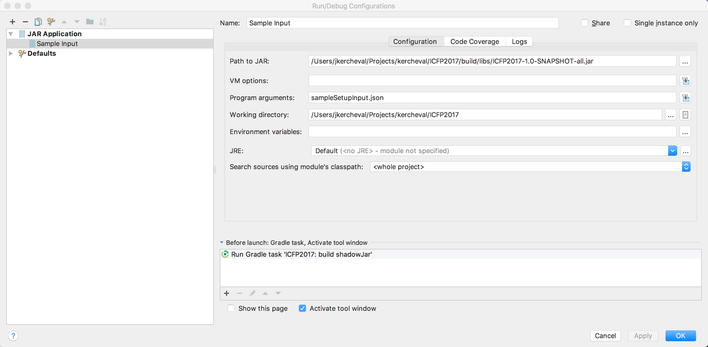

# ICFP2017

2017 ICFP Programming Contest at https://icfpcontest2017.github.io/

## Issues and things needed to be done

Please use the issues tab for known actions that need work to ensure we have a good feel for ongoing work.

## How to build

```bash
./gradlew clean build shadowJar 
```
## How to run in simulated offline mode
```bash
cat sampleSetupInput.json | java -jar build/libs/ICFP2017-1.0-SNAPSHOT-all.jar 
```
## How to run in online mode
```bash
java -jar build/libs/ICFP2017-1.0-SNAPSHOT-all.jar -mode=online -host=punter.inf.ed.ac.uk -port=9004 
```

## How to create an IntelliJ configuration file for input

The first parameter of the jar file startup will be converted to stdin to simplify test and debug of the system.  Create a configuration in IntelliJ/Eclipse with the build step as a precursor to obtain the shadow jar and then pass the file you are testing as the first parameter.


