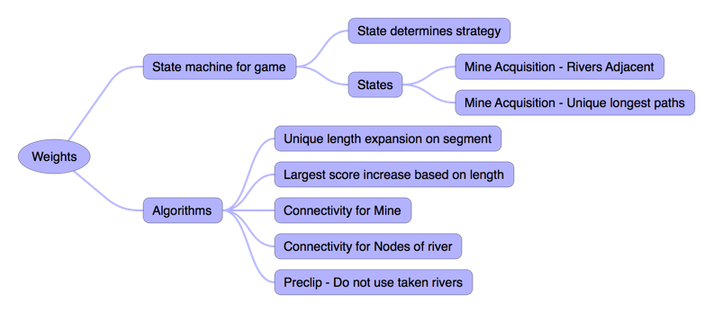

# ICFP2017 

2017 ICFP Programming Contest at https://icfpcontest2017.github.io/

## How to build

```bash
./gradlew clean build shadowJar 
```
## How to run in simulated offline mode

```bash
cat sampleSetupInput.json | java -jar build/libs/ICFP2017-1.0-SNAPSHOT-all.jar 
```

## How to run in the lamduct offline simulator

```bash
lamduct --client-instance-timeout=60 --client-instance-logfile=/dev/stdout --log-level=3 --game-port=9017 ./run-offline.sh
```

## How to run in online mode

```bash
java -jar build/libs/ICFP2017-1.0-SNAPSHOT-all.jar -mode=online -host=punter.inf.ed.ac.uk -port=9004 
```

## Capturing a log

```bash
java -jar build/libs/ICFP2017-1.0-SNAPSHOT-all.jar -mode=online -host=punter.inf.ed.ac.uk -port=9009 -capture
```

This will place the log in stderr.  Using the following:

```bash
java -jar build/libs/ICFP2017-1.0-SNAPSHOT-all.jar -mode=online -host=punter.inf.ed.ac.uk -port=9009 -capture &> capture.txt
```

## Replaying a log

Show replayer/index.html in a browser, paste the log in the replay information box and press the replay button.

## Running a server locally

Use python 2.7

```bash
virtualenv -p /usr/bin/python2.7  ~/Projects/PythonEnvs/Python2
source ~/Projects/PythonEnvs/Python2
pip install flask
pip install gevent
pip install flask-sockets
pip install six

cd puntfx/puntfxsvr
python server.py
```

NOTES:
Only supports sample.json right now. I'll add more maps on.

## Running a client and connecting locally
Load in your browser puntfx/index.html
It is already configured to connect to localhost:5000
Ignore the port for the game - the local server supports only one game

## Overview notes

Test and description links

- Overview - <https://icfpcontest2017.github.io/>
- Map Viewer - <http://punter.inf.ed.ac.uk/graph-viewer/>
- Interactive Player UI - <http://punter.inf.ed.ac.uk/puntfx/>
- Test Server Status - <http://punter.inf.ed.ac.uk/status.html>

Initial design conversation notes:



Published submission was at https://drive.google.com/open?id=0BzsKZZJ1xvVIa3h3WTROTzlPMUU
